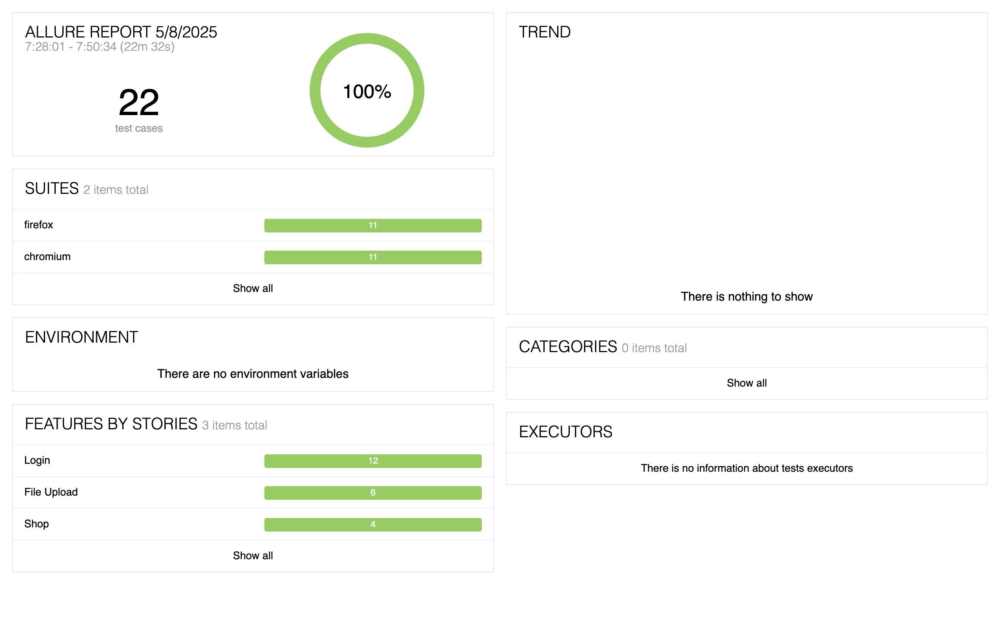

Ecommerce example
This project runs against the [QA practice site](https://qa-practice.netlify.app) using [Playwright](https://playwright.dev/).

## Running the tests
By default, tests run in parallel on Chromium, Firefox and Webkit (Safari).

**To run:**
`npm i`
`npx playwright install`
`npx playwright test`

Chromium: `npx playwright test --project=chromium`

Firefox: `npx playwright test --project=firefox`

Webkit: `npx playwright test --project=webkit`

### Reporting
This project uses [allure](https://allurereport.org/) for reporting tests.

To install Allure, follow the instructions [here](https://allurereport.org/docs/install/). After the tests run, view the report by entering this into your terminal:
`allure serve allure-results`
