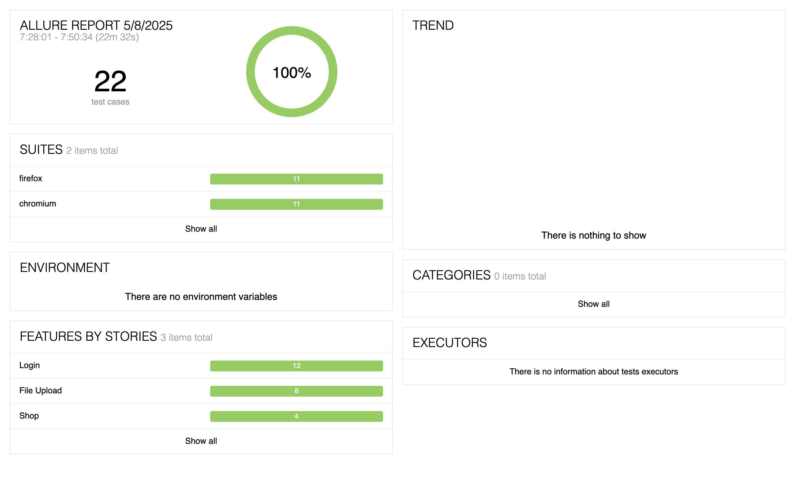
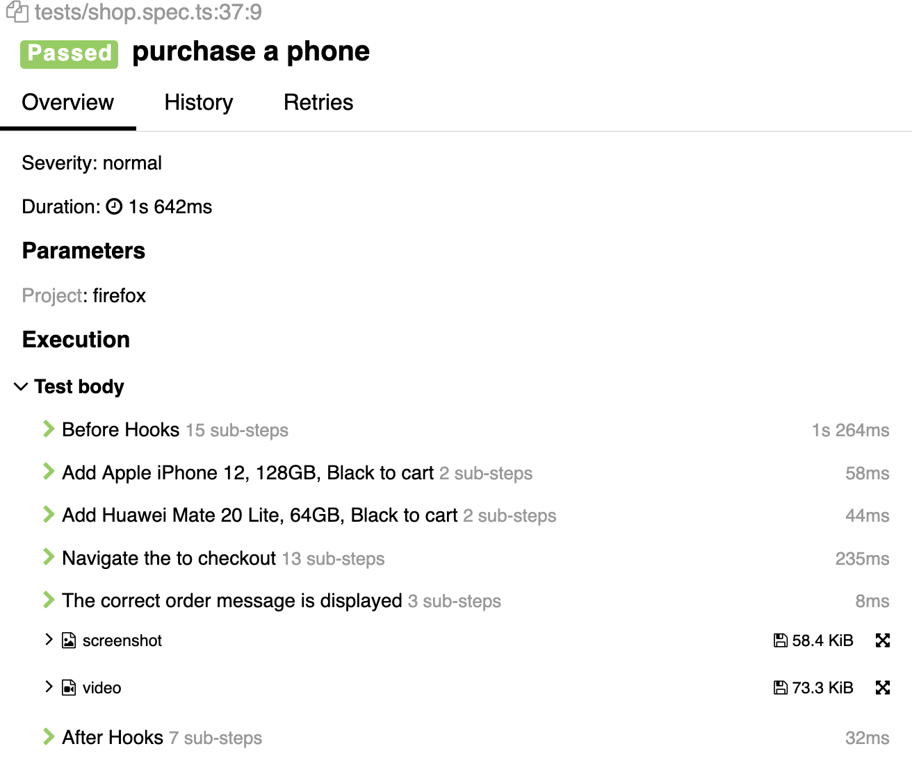

Ecommerce example
This project runs against the [QA practice site](https://qa-practice.netlify.app) using [Playwright](https://playwright.dev/).

## Running the tests

By default, tests run in parallel on Chromium, Firefox and Webkit (Safari).

**To run:**
`npm i`
`npx playwright install`
`npx playwright test`

Chromium: `npx playwright test --project=chromium`

Firefox: `npx playwright test --project=firefox`

Webkit: `npx playwright test --project=webkit`

## Test structure
Tests are structured using the Page Object Model. each page of the web application is defined by a class containing the elements and methods required for interacting with that page. These are located in the `pages` directory.
The pages are initialised via [fixtures](https://playwright.dev/docs/test-fixtures) where they can be used in relevant tests (located in the `tests` directory).

### Reporting

This project uses [allure](https://allurereport.org/) for reporting tests.

Allure provides great readability of tests, with attachments.

Once fully configured, it provides statistics about trends (most often failed tests, average test duration).

To install Allure, follow the instructions [here](https://allurereport.org/docs/install/). After the tests run, view the report by entering this into your terminal:
`allure serve allure-results`
